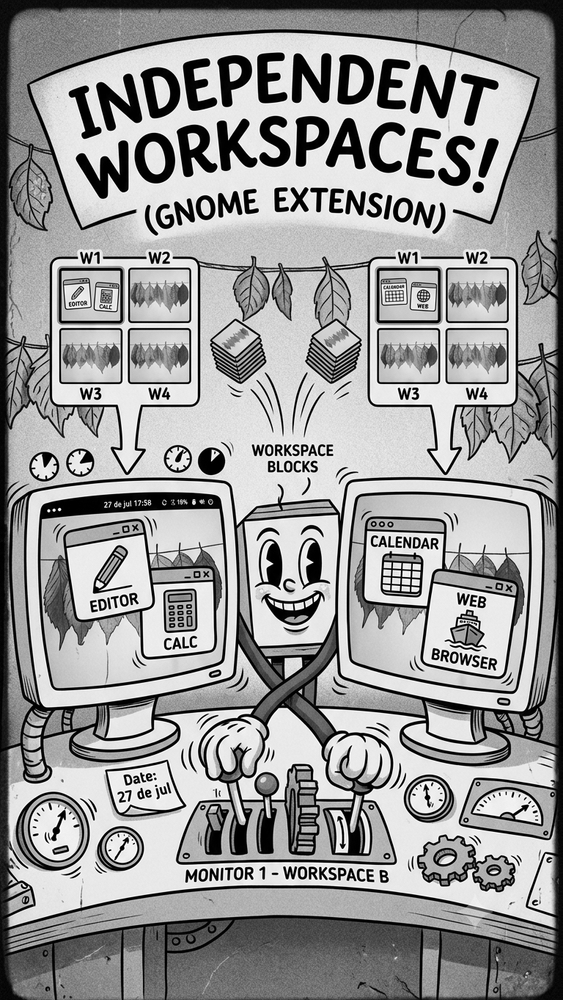

<div align="center">



# Workspace Islands

</div>

**Independent workspaces on every monitor, for GNOME Shell 50.** Switch workspaces on one screen and the others stay exactly where you left them. No tiling, no new window manager, no relearning GNOME.

Each monitor is its own island: it keeps its own set of workspaces, and nothing you do on one disturbs the rest.

> **Status: early.** Everything described here works, but it has been used by one person on one machine. Bug reports are genuinely useful right now.

## The problem

GNOME gives you exactly two multi-monitor modes, and neither is what most people want:

| Mode | What happens |
| --- | --- |
| Workspaces on all displays | Switching a workspace switches **every** monitor at once |
| Workspaces on primary only | Secondary monitors are **frozen** on one fixed set of windows |
| **Workspace Islands** | Each monitor rotates through its **own** workspaces, independently |

Truly independent per-monitor workspaces, macOS style, [have been requested for years](https://gitlab.gnome.org/GNOME/gnome-shell/-/issues/5195) and do not exist natively.

The closest existing extension is [Switch workspaces on active monitor](https://extensions.gnome.org/extension/2911/), which simulates the switch on whichever monitor is active and supports up to GNOME 48. This one targets 50, keeps per-monitor state that survives a logout, and integrates with the panel indicator, the overview and the touchpad gestures rather than only remapping a shortcut.

## Before you install

- [ ] **GNOME Shell 50**, on Wayland
- [ ] **At least two monitors** — the extension only acts on non-primary ones, so a single display gives it nothing to do
- [ ] **PaperWM disabled**, if you have it — the two fight over the same mutter setting with opposite values
- [ ] `org.gnome.mutter workspaces-only-on-primary` set to `true`

The last one is the setting everything rests on. The extension checks it, warns you if it is off, and offers a one-click fix in its preferences. To set it by hand:

```bash
gsettings set org.gnome.mutter workspaces-only-on-primary true
```

## Install

Not on [extensions.gnome.org](https://extensions.gnome.org) yet. For now, build it yourself:

```bash
git clone https://github.com/danielbernalo/gnome-workspace-islands
cd gnome-workspace-islands
make pack
gnome-extensions install --force workspace-islands@danielbernalo.github.io.shell-extension.zip
gnome-extensions enable workspace-islands@danielbernalo.github.io
```

Then **log out and back in**. Wayland cannot reload the shell in place, so a new extension is not picked up until the session restarts.

Verify it loaded:

```bash
gnome-extensions info workspace-islands@danielbernalo.github.io   # State: ACTIVE
```

If it says `ERROR`, open the Extensions app — it shows the failure with a stack trace, which is the fastest way to report a useful bug.

## Using it

Everything acts on **the monitor holding the focused window**. On the primary monitor the shortcuts do nothing on purpose: GNOME's own workspaces already cover it, and hijacking them would break what already works.

### Keyboard

| Shortcut | Action |
| --- | --- |
| `Super+Alt+1…4` | Switch to virtual workspace N |
| `Super+Alt+←` / `→` | Previous / next virtual workspace |
| `Super+Alt+Shift+←` / `→` | Move the focused window to the previous / next workspace |

All of them are rebindable in preferences.

> **If you raise the workspace count above 4**, the extra ones have no shortcut until you assign it. `Super+Alt+5…8` are deliberately unbound by default so they do not silently claim keys you may already use.

### Touchpad and mouse

| Gesture | Where | Action |
| --- | --- | --- |
| Three-finger swipe ← / → | On a secondary monitor | Switch workspace, following your fingers |
| Three-finger swipe ← / → | In the overview | Same, on the monitor under the pointer |
| Two-finger scroll | In the overview | Switch workspace |
| Mouse wheel | In the overview | Switch workspace |

Over the primary monitor every gesture stays GNOME's own, untouched.

### The overview

Press `Super`. A secondary monitor now scrolls through its virtual workspaces the way the primary scrolls through native ones — active workspace centred, neighbours peeking at the edges, thumbnail strip above.

- **Click a window** to go to it. The monitor switches to whichever workspace holds it.
- **Drag a window onto a thumbnail** to move it to that workspace.
- **Drag a window in from the primary monitor** and drop it on the page you are looking at.

### Reading where you are

The **workspace dots in the top bar** — the ones that replaced the "Activities" label in GNOME 48 — follow the monitor you are working on. Focused on the primary, they show native workspaces and behave exactly as they always have. Move focus to a secondary monitor and the same dots show that monitor's workspaces instead. One indicator, always describing the screen you are on.

On a switch, the familiar **pill with dots** appears on the monitor that changed, not on the primary.

## Preferences

Open with the gear in the Extensions app, or:

```bash
gnome-extensions prefs workspace-islands@danielbernalo.github.io
```

### Virtual workspaces

| Option | Default | What it does |
| --- | --- | --- |
| **Workspaces per monitor** | `4` | How many workspaces each secondary monitor gets. Range 2–8. Applies to every secondary monitor; the primary keeps using GNOME's own. |

Lowering the count folds everything beyond the new end into the last workspace rather than losing those windows.

### Switching

All three default to **on**, and each buys its polish with something real. That is why they are switches and not assumptions.

| Option | Default | What it does | Turn it off if… |
| --- | --- | --- | --- |
| **Touchpad gesture** | on | Three-finger swipe on secondary monitors | You want that gesture free, or it fights something else you use |
| **Slide animation** | on | Workspaces slide across like GNOME's, instead of showing the minimize animation | You see visual artifacts, or you are on hardware where the extra work costs you. This is the cheapest thing to switch off — everything else keeps working |
| **On-screen indicator** | on | The dots pill on the monitor that changed | You find it noisy. The panel dots already tell you where you are |

The slide is the one worth understanding: making two workspaces visible side by side requires briefly cloning their windows. The clones live for about a quarter second and are destroyed with the animation, but if anything ever looks wrong during a switch, this switch is the first thing to try.

### Troubleshooting

| Option | Default | What it does |
| --- | --- | --- |
| **Debug logging** | off | Logs every workspace switch, gesture and drop to the journal |

With it on, watch what the extension is doing:

```bash
journalctl -f -o cat /usr/bin/gnome-shell | grep workspace-islands
```

The **Diagnostics** section of the same page shows the live state of `workspaces-only-on-primary` and offers a button to turn it back on. It is there because that setting is the one thing other software flips underneath you, and when it is off nothing works and the reason is invisible.

## What survives a logout

Windows have **no stable identity across sessions** — a window is a live object, and no id outlives a logout. So "put this exact window back on workspace 2" is not implementable by anyone. What is stored instead:

- **Which workspace each monitor was left on**, keyed by the physical connector, so unplugging a display and plugging it back in returns it to the arrangement you left.
- **Where each application belongs.** New windows of an app land where you last put that app. A deliberate heuristic: two windows of the same app go to the same place, which is usually right and always correctable by moving the window.

## Troubleshooting

**A shortcut does nothing.** You are probably focused on the primary monitor, where it is a no-op by design. Turn on debug logging and the journal will say so explicitly.

**A window vanished.** The extension hides windows by minimizing them, so anything on an inactive workspace is minimized — visible in the dash, restorable from there. Clicking it un-minimizes it *and* takes you to the workspace it lives on. Disabling the extension restores everything unconditionally.

**Something is badly wrong and you want out.** This turns off every user extension immediately, without a logout and without uninstalling anything:

```bash
gsettings set org.gnome.shell disable-user-extensions true
```

Set it back to `false` when you are done. To disable only this one:

```bash
gnome-extensions disable workspace-islands@danielbernalo.github.io
```

**Workspaces are leaking into each other.** Something turned `workspaces-only-on-primary` off. The extension notifies you when this happens; the Diagnostics section in preferences turns it back on.

**Windows show a minimized marker in the dash.** Expected. Minimizing is how windows are parked, and it was chosen over the alternatives because it is the only approach that survives a native workspace switch — see below.

## How it works

### Why this is hard

In Mutter a workspace belongs to the **display**, not to the monitor. The data model is `window → workspace`; the monitor is not part of that relationship, and only one workspace is active at a time across the whole display.

On top of that, window actors cannot be freely relocated. From PaperWM's `tiling.js`:

> Clones are necessary due to restrictions mutter places on MetaWindowActors. WindowActors can only live in `global.window_group` and can't be moved reliably outside the monitor.

That is why PaperWM builds a full clone pipeline — and why it ended up a tiling window manager. **The tiling is a consequence of that architecture, not the goal.**

### The approach here

The opposite direction, which is what keeps tiling out of the picture.

PaperWM forces `workspaces-only-on-primary = false` because it wants real native workspaces per monitor, which then requires clones. This extension **keeps that setting `true`**.

With it on, Mutter marks windows on non-primary monitors as *on-all-workspaces* — sticky. They are already present on every workspace, immune to native switches. So nothing needs cloning, and the problem collapses to a much smaller one:

**decide which windows are shown.**

```
Primary monitor              Secondary monitor
────────────────             ─────────────────
Native GNOME workspaces      Virtual workspaces
Super+1..4, untouched        Map<index, Set<window>>
                             switch = show set B, hide set A
```

### Why minimize, and not something subtler

Everything rests on how a window is made to stop being visible. Two candidates were built side by side and compared under real use:

| | `actor-hide` | `minimize` ✅ chosen |
| --- | --- | --- |
| Visual | Instant, no animation | Minimize animation |
| Window state | Untouched | Mutter knows it is minimized |
| Focus | Must be handled manually | Handled by the WM |
| Survives a native workspace switch | **No — gets overwritten** | **Yes** |
| Risk | Inconsistent state on a crash | Lower |

**`actor-hide` is overwritten by native workspace switches.** A switch walks the window actors and shows those belonging to the incoming workspace. Sticky windows belong to *every* workspace, so Mutter showed all of them and every virtual workspace landed on screen at once.

That could be worked around by reasserting visibility one frame later — but that is a race against the shell, not a fix.

`minimize` is structurally immune. Minimized state is real window state, not a flag Mutter recomputes, so a workspace switch leaves it alone. No race to lose, and focus handover comes free because the window manager already knows a minimized window cannot hold focus.

The cost is the minimize animation and the marker in the dash. Both were judged acceptable; the race was not.

### Where it touches GNOME

Five shell seams, all in `src/overview.js` and `src/slide.js` on purpose: when a GNOME update breaks this extension, those are the files to open.

The two that cost the most to discover:

**A second swipe tracker can never work.** `TouchpadSwipeGesture` claims every three-finger swipe on orientation alone, knows nothing about monitors, and returns `EVENT_STOP` even when its owner declined the gesture. And overriding the handlers does not work either: they are connected with `.bind(this)` at construction, which captures the original function before any extension exists — the override installs, reports success, and is never called. The shell's tracker is disabled and replaced instead.

**GNOME's workspace thumbnails deliberately omit minimized windows** (`_isOverviewWindow` requires `showing_on_its_workspace()`), which here would be every window on every inactive workspace. A faithful copy would render identical empty rectangles. The strip uses `Shell.WindowPreviewLayout` — the C layout `WindowPreview` builds on, which paints the window texture rather than cloning a possibly unmapped actor.

### Layout

```
src/
├── extension.js      lifecycle, signals, shortcut handlers
├── monitorState.js   per-monitor workspace model (keyed by connector)
├── visibility.js     hiding via minimize, and why
├── slide.js          touchpad gesture and the sliding switch
├── keybindings.js    keybinding registration and teardown
├── persistence.js    saved arrangement across sessions and hotplug
├── indicator.js      takes over the panel's own workspace dots
├── switcherPopup.js  on-screen dots, on the monitor that switched
├── altTab.js         window-switcher filtering
├── overview.js       the shell seams the overview needs
├── workspacesView.js scrolling pages and thumbnail strip, ported
├── prefs.js          GTK4/Adwaita preferences (separate process)
└── schemas/          gsettings schema
```

## Contributing

```bash
make install   # symlink src/ into GNOME's extension dir — edits apply live
make doctor    # check every precondition; run this first when something is off
make nested    # launch a nested session for testing
make logs      # follow gnome-shell logs
make pack      # build the installable bundle
```

Nested testing needs **Mutter Devkit**, a separate package:

```bash
sudo pacman -S mutter-devkit    # Arch / CachyOS
```

Add a **second virtual display** from the devkit UI before testing, or the extension has nothing to act on.

Three things that cost time if you do not know them:

- **Wayland has no `Alt+F2 → r`.** The shell cannot restart in place. Test nested, then log out and back in for a real session.
- **GJS caches ES modules for the life of the process.** Editing a file does not affect a running shell, even if you toggle the extension off and on — you need a fresh shell.
- **`--nested` was removed in GNOME 49.** Mutter Devkit replaced it, and `--wayland` alone is not a substitute: it tries to take over your session and dies with `EBUSY`.

`make install` and `make pack` are different installs. The first symlinks `src/` so edits apply live; the second builds a bundle you install as a copy. `make doctor` tells you which one you have.

## Deliberately not built

**Filtering the app switcher.** `AppSwitcher` is a module-private const built inline inside its popup's constructor; patching it means reimplementing that constructor. Instead, an outside un-minimize is treated as intent: pick a window from workspace 2 via Alt+Tab, the dash or a notification, and that monitor switches to workspace 2 and takes you there. Better behaviour than hiding it, at none of the risk.

**A panel menu for switching a monitor you are not on.** The indicator used to be its own panel button with a dropdown. It was dropped when the indicator moved into the Activities button: a second panel button is the most obvious tell that an extension is installed, and the shortcuts already cover the monitor you are working on. Switching a monitor you are *not* focused on is the only thing lost, and it is rare enough not to earn back the UI.

## License

GPL-2.0-or-later
